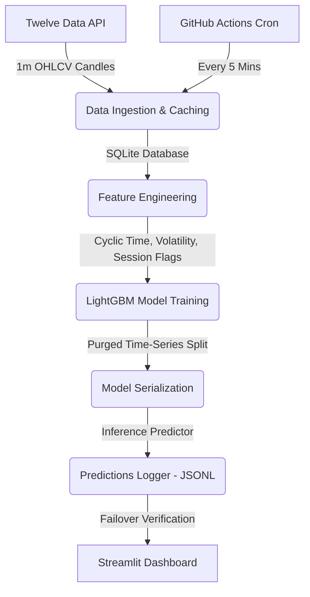

# 🕵️‍♂️ Stock Holmes: XAUUSD 5m-Ahead Predictor

A time-series intelligence system that predicts Gold spot price direction (`UP`/`DOWN`/`FLAT`) 5 minutes into the future using machine learning, built with python, LightGBM, and the Twelve Data API.

[](https://github.com/talhashady/stock-holmes/actions/workflows/ingestion_inference.yml)
[](LICENSE)
[](https://www.python.org/)
[](https://stock-holmes.streamlit.app/)

---

## 🔗 Live Demo
Access the live Streamlit Community Cloud dashboard at:  
👉 **[https://stock-holmes.streamlit.app/](https://stock-holmes.streamlit.app/)**

---

## 📊 Dashboard Preview
*(Insert a GIF or screenshot showing the live prediction log updates here)*  
`assets/dashboard_preview.png`

---

## 📝 Project Overview

Stock Holmes is a predictive system designed to capture short-horizon inefficiencies in the Gold spot market (XAU/USD). Rather than attempting to regress exact future prices (which is heavily dominated by noise at short timeframes), this system reframes the target into a **3-way classification problem**:
*   📈 **UP**: Price change > +0.01% (+10 bps)
*   📉 **DOWN**: Price change < -0.01% (-10 bps)
*   ➡️ **FLAT**: Price change within ±0.01%

**Disclaimer**: In line with the random-walk hypothesis, predicting short-term asset movements is extremely difficult. This model aims to extract a minor directional statistical edge over a naive baseline, not guarantee trade profitability.

---

## 🧭 Table of Contents
1. [Features](#-features)
2. [System Architecture](#-system-architecture)
3. [Tech Stack](#-tech-stack)
4. [Quickstart & Installation](#-quickstart--installation)
5. [How It Works](#-how-it-works)
6. [Results & Performance](#-results--performance)
7. [Roadmap](#-roadmap)
8. [License](#-license)
9. [Author & Contact](#-author--contact)

---

## ✨ Features
*   🔮 **Real-Time Classification**: Forecasts Gold price direction 5 minutes into the future along with exact signal confidence weights.
*   📈 **Interactive Plotly Visualizations**: View resolved predictions overlaid on the actual price action line chart, with colored indicators representing prediction outcome correctness.
*   🔁 **GitHub Actions Automation**: Scheduled ingestion and inference runs every 5 minutes during market hours, automatically resolving past pending forecasts.
*   💾 **Resilient Logging**: Zero-infrastructure persistent prediction logging to a git-committed append-only JSONL file (`data/predictions_log.jsonl`).
*   🛡️ **API Failover Mitigations**: Transparent failover to Twelve Data if Alpha Vantage rate limits are exceeded, ensuring uptime.
*   🔒 **Anti-Leakage Safeguards**: Implements a strict 5-candle validation purge boundary in feature engineering to prevent target leakage.

---

## 🏗️ System Architecture



---

## 🛠️ Tech Stack

*   **Language**: Python 3.11+
*   **Machine Learning**: LightGBM, Scikit-learn
*   **Database & Storage**: SQLite, JSON Lines (append-only)
*   **Data Processing**: Pandas, NumPy
*   **Visualization**: Streamlit, Plotly, Matplotlib
*   **CI/CD / Pipeline**: GitHub Actions

---

## 🚀 Quickstart & Installation

To clone and run this application locally:

### 1. Clone the repository
```bash
git clone https://github.com/talhashady/stock-holmes.git
cd stock-holmes
```

### 2. Configure Environment Variables
Create a `.env` file in the root directory and add your Twelve Data API key:
```env
TWELVE_DATA_API_KEY=your_twelve_data_api_key_here
```

### 3. Install Dependencies
```bash
pip install -r requirements.txt
```

### 4. Run the Streamlit Dashboard
```bash
streamlit run app/dashboard.py
```
The app will open automatically in your browser at `http://localhost:8501`.

---

## 🧠 How It Works

### Feature Engineering
The model generates predictions based on stationarized rolling windows:
*   **Volatility Regimes**: Realized volatility (rolling log returns standard deviation) and Average True Range (ATR).
*   **Momentum Indicators**: Relative Strength Index (RSI), Moving Average Convergence Divergence (MACD), and Bollinger Band widths.
*   **Market Hours Flagging**: Sin/cos cyclical encoding of hours, with binary flags identifying London/New York market open overlaps.

### Target Purging
To prevent lookahead leakage during training and walk-forward validation, the training dataset drops the last 5 index rows before validation boundaries. This firewalls features from target labels (which depend on future $t+5$ prices).

### Failover Mitigation
The metals spot price logger uses Alpha Vantage as primary (allowing both Gold and Silver tracking). If Alpha Vantage is rate-limited, it completes a failover to the Twelve Data API to log the Gold Spot Price, ensuring prediction uptime.

---

## 📊 Results & Performance

Evaluating the LightGBM model on historical testing sets:

| Model / Baseline | Accuracy | Directional Edge vs. Sign Baseline |
| :--- | :--- | :--- |
| **Naive Flat Baseline** | 11.76% | N/A |
| **Naive Return-Sign Baseline** | 32.62% | Baseline |
| **Stock Holmes LightGBM** | **41.71%** | **+9.09%** |

The model successfully beats the naive last-price-carry-forward baseline by **+9.09%** in directional accuracy.

---

## 🗺️ Roadmap
- [x] Implement real-time Twelve Data ingestion.
- [x] Configure LightGBM walk-forward training & predictions pipeline.
- [x] Implement dynamic gap calculation & database locks cleanup.
- [x] Build Streamlit dashboard with custom CSS theme.
- [x] Add interactive Plotly Predicted vs. Actual price overlay.
- [x] Deploy scheduled GitHub Actions cron workflow.
- [ ] Add support for Multi-Asset tracking (e.g. `XAG/USD`, `EUR/USD`).
- [ ] Implement automated weekly retraining on Github Actions.

---

## 📄 License
This project is licensed under the MIT License - see the [LICENSE](LICENSE) file for details.

---

## 👤 Author & Contact
*   **Author**: Talha Shady
*   **GitHub**: [@talhashady](https://github.com/talhashady)
