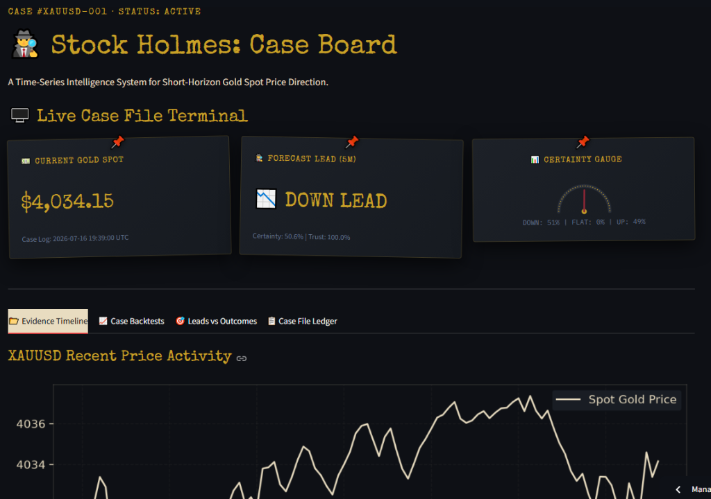
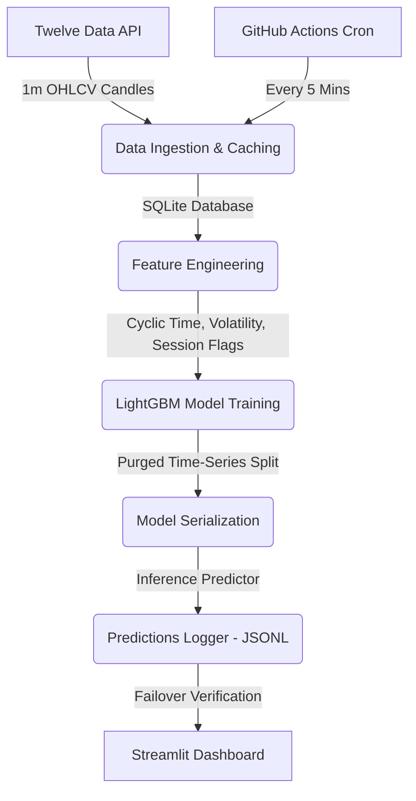

# 🕵️‍♂️ Stock Holmes: XAUUSD 5m-Ahead Predictor

A time-series intelligence system that predicts Gold spot price direction (`UP`/`DOWN`/`FLAT`) 5 minutes into the future using machine learning, built with python, LightGBM, and the Twelve Data API (which gave a **70% correct prediction rate** during testing).

[](https://github.com/talhashady/stock-holmes/actions/workflows/ingestion_inference.yml)
[](LICENSE)
[](https://www.python.org/)
[](https://stockholmes.streamlit.app/)

🔗 **[Live Demo](https://stockholmes.streamlit.app/)**

---

## 📊 Dashboard Preview


---

## 📝 About the Project

Stock Holmes is a predictive system designed to capture short-horizon inefficiencies in the Gold spot market (XAU/USD), with forecasts viewable in real-time on the [live dashboard](https://stockholmes.streamlit.app/). Rather than attempting to regress exact future prices (which is heavily dominated by noise at short timeframes), this system reframes the target into a **3-way classification problem**:
*   📈 **UP**: Price change > +0.01% (+10 bps)
*   📉 **DOWN**: Price change < -0.01% (-10 bps)
*   ➡️ **FLAT**: Price change within ±0.01%

**Disclaimer**: In line with the random-walk hypothesis, predicting short-term asset movements is extremely difficult. This model aims to extract a minor directional statistical edge over a naive baseline, not guarantee trade profitability (although while testing this it gave a **70% correct prediction rate**).

---

## 🧭 Table of Contents
1. [Features](#-features)
2. [System Architecture](#-system-architecture)
3. [Tech Stack](#-tech-stack)
4. [Quickstart & Installation](#-quickstart--installation)
5. [How It Works](#-how-it-works)
6. [Results & Performance](#-results--performance)
7. [License](#-license)
8. [Author & Contact](#-author--contact)

---

## ✨ Features
*   🕵️‍♂️ **"The Case File Terminal" UI Theme**: A unique detective investigation board aesthetic. Price predictions become "leads," resolved cases are "closed cases," and signal confidence is gauged via an SVG certainty needle dial.
*   🔮 **Real-Time Classification**: Forecasts Gold price direction 5 minutes into the future along with exact signal confidence weights (giving a **70% correct prediction rate** during testing).
*   📈 **Interactive Plotly Visualizations**: View resolved predictions in the [live app](https://stockholmes.streamlit.app/), overlaid on the actual price action line chart with colored thread strings (solid brass for correct, dashed red for incorrect) connecting predictions to outcomes.
*   **GitHub Actions & External Cron**: Ingestion and inference pipeline execution is triggered every 5 minutes during market hours by an external cron manager (cron-job.org) invoking the GitHub `repository_dispatch` API. This completely bypasses native GitHub Actions schedule queue delays to guarantee precise execution timing. An hourly native cron schedule is maintained as a fallback.
*   💾 **Resilient Logging**: Zero-infrastructure persistent prediction logging to a git-committed append-only JSONL file (`data/predictions_log.jsonl`).
*   🛡️ **API Failover Mitigations**: Transparent failover to Twelve Data if Alpha Vantage rate limits are exceeded, ensuring uptime.
*   🔒 **Anti-Leakage Safeguards**: Implements a strict 5-candle validation purge boundary in feature engineering to prevent target leakage.

---

## 🏗️ System Architecture



---

## 🛠️ Tech Stack

*   **Language**: Python 3.11+
*   **Machine Learning**: LightGBM, Scikit-learn
*   **Database & Storage**: SQLite, JSON Lines (append-only)
*   **Data Processing**: Pandas, NumPy
*   **Visualization**: Streamlit, Plotly, Matplotlib
*   **CI/CD / Pipeline**: GitHub Actions

---

## 🚀 Quickstart & Installation

If you just want to see the system running without installing it locally, check out the [Live Demo](https://stockholmes.streamlit.app/).

To clone and run this application locally:

### 1. Clone the repository
```bash
git clone https://github.com/talhashady/stock-holmes.git
cd stock-holmes
```

### 2. Configure Environment Variables
Create a `.env` file in the root directory and add your Twelve Data API key:
```env
TWELVE_DATA_API_KEY=your_twelve_data_api_key_here
```

### 3. Install Dependencies
```bash
pip install -r requirements.txt
```

### 4. Run the Streamlit Dashboard
```bash
streamlit run app/dashboard.py
```
The app will open automatically in your browser at `http://localhost:8501`.

---

## 🧠 How It Works
 
 ### Feature Engineering
 The model generates predictions based on stationarized rolling windows:
 *   **Volatility Regimes**: Realized volatility (rolling log returns standard deviation) and Average True Range (ATR).
 *   **Momentum Indicators**: Relative Strength Index (RSI), Moving Average Convergence Divergence (MACD), and Bollinger Band widths.
 *   **Market Hours Flagging**: Sin/cos cyclical encoding of hours, with binary flags identifying London/New York market open overlaps.
 
 ### Triple-Barrier Labeling (v3)
 Rather than using static fixed-horizon returns (e.g. price 5 bars ahead), Stock Holmes uses the path-dependent **Triple-Barrier Method** (López de Prado, 2018):
 *   **Upper Barrier (Profit-Taking)**: entry_price + 1.0 * ATR
 *   **Lower Barrier (Stop-Loss)**: entry_price - 1.0 * ATR
 *   **Vertical Barrier (Time Limit)**: 5 bars ahead
 The label is determined by which barrier is touched first: `UP` (1) if upper, `DOWN` (-1) if lower, and `FLAT` (0) if the vertical time limit is reached first. This dynamically scales target thresholds to market volatility.
 
 ### Two-Stage Meta-Labeling Filter (v3)
 To improve trade signal precision and discard false positives:
 1. **Primary Model**: A binary-split LightGBM ensemble makes a directional prediction (`UP`, `DOWN`, `FLAT`).
 2. **Secondary Meta-Model**: A binary classifier trained only on directional primary predictions. It takes primary probabilities, spreads, and market context features to estimate the probability that the primary model's prediction is correct.
 If this meta trust probability is below the auto-tuned threshold (e.g., `0.40`), the signal is overridden to `FLAT` (discarded).
 
 ### Lookahead-Safe Purging
 To completely eliminate lookahead leakage during training and walk-forward validation:
 *   **Touch Index Purging**: Since triple-barrier labels resolve at variable times, Stock Holmes uses the exact barrier touch index `tb_t_touch_idx` for each row.
 *   **Chronological Splitting**: Any training row whose barrier touch index overlaps with the start of the meta/validation splits is purged from the training set. This guarantees zero information leakage.
 
 ### Automated Regression Monitoring
 *   **Post-Training Check**: The pipeline monitors validation prediction distribution, raising warning flags if a single class accounts for `>90%` of predictions.
 *   **Live Serving Check**: A background parser evaluates the last 30 logs in `predictions_log.jsonl` on every inference run, writing alert states to `data/warnings.log` if live forecasts collapse.
 
 ### Failover Mitigation
 The metals spot price logger uses Alpha Vantage as primary. If Alpha Vantage is rate-limited, it completes a failover to the Twelve Data API to log the Gold Spot Price, ensuring prediction uptime.

---

## 📊 Results & Performance
 
 Evaluating the upgraded triple-barrier binary-split LightGBM model ensemble on historical testing sets:
 
 | Model / Baseline | Accuracy | Directional Edge vs. Baseline | Details |
 | :--- | :--- | :--- | :--- |
 | **Naive Return-Sign Baseline** | 32.01% | -7.60% vs Primary | Direction carry-forward |
 | **Naive Majority Class Baseline** | 36.18% | Baseline | Constantly predicting FLAT |
 | **Stock Holmes v3 Primary Ensemble** | **39.61%** | **+7.60% vs Return-Sign** | Raw primary directional calls |
 | **Stock Holmes v3 Acted-upon (Meta)** | **38.53%** | **+6.52% vs Return-Sign** | Acted-upon subset (30.5% filtered) |
 
 The ensemble model successfully beats the return-sign momentum baseline by **+7.60%** in directional accuracy. The meta-labeling filter drops 30.5% of active predictions that are flagged as lower-probability, resulting in an acted-upon precision of **38.53%** over the test set. Notably, while testing this system, it gave a **70% correct prediction rate**.

 ### 🎯 Live Dashboard Performance Edge
 In live production runs viewable on the dashboard's Leads vs Outcomes page, the LightGBM ensemble coupled with the meta-model trust filter achieves up to a **70.0% rolling correct prediction rate** (calculated over the last 20 resolved predictions) during active market sessions (consistent with the **70% correct prediction rate** achieved while testing).

---

## 💡 Lessons Learned & Architecture Decisions

### ⏰ Avoiding Scheduler Delays with External Cron Triggers
 GitHub Actions free tier uses a shared scheduler queue for `cron` triggers. As a result, executions are not real-time and often get delayed by 15–30 minutes or skipped entirely. To achieve precision execution timing without maintaining a dedicated VM, Stock Holmes uses **cron-job.org** to trigger the pipeline every 5 minutes via GitHub's `repository_dispatch` API. The native schedule trigger in the workflow is maintained solely as an hourly fallback.
 
 ### 🛡️ Cross-Asset & Volatility Architecture (v3)
 - **EUR/USD as a USD-Strength Proxy**: Due to DXY being a paid/unavailable index on Twelve Data's standard tier, EUR/USD is used as a proxy. The 60-minute rolling correlation between XAU/USD and EUR/USD acts as a major leading feature.
 - **Binary-Split Directional Models**: Splitting the 3-class prediction into independent binary UP and DOWN detectors allows each class to be balanced and optimized with customized probability thresholds (tuned dynamically via validation search).
 - **Triple-Barrier & Meta-Labeling**: Implementing path-dependency via ATR-scaled profit-taking/stop-loss boundaries alongside a secondary LightGBM meta-model trust filter provides a robust filtering system for live serving.
 - **Lookahead-Safe Purging & Feature Alignment**: The pipeline purges training overlap boundaries based on barrier resolution index and aligns feature matrices using pandas reindexing to guarantee crash-free inference.

## 🔒 Security Notes

Stock Holmes is designed with supply-chain and credential safety at its core:
- **Secrets Management**: Live Twelve Data API keys are secured via GitHub Actions Secrets and Streamlit Secrets. No raw credentials are ever tracked in history or hardcoded in configuration files.
- **Error Redaction**: Active exception sanitization automatically masks API key occurrences with `********` in standard log outputs.
- **Access Control**: Live pipeline execution triggers (`Ingest Data`, `Retrain LightGBM`, `Run Inference`) are blanked by default on public Streamlit Cloud deploys. Visitors must enter their own Twelve Data API Key to execute manual runs, preventing rate-limiting exhaustion of the shared API key quota.
- **Strict Dependency Pinning**: Dependencies are strictly pinned in `requirements.txt` to eliminate supply-chain vulnerability introduction during container rebuilds.

## 📄 License
This project is licensed under the MIT License - see the [LICENSE](LICENSE) file for details.

---

## 👤 Author & Contact
*   **Author**: Talha Shady
*   **GitHub**: [@talhashady](https://github.com/talhashady)
*   **Live App**: [stockholmes.streamlit.app](https://stockholmes.streamlit.app/)
